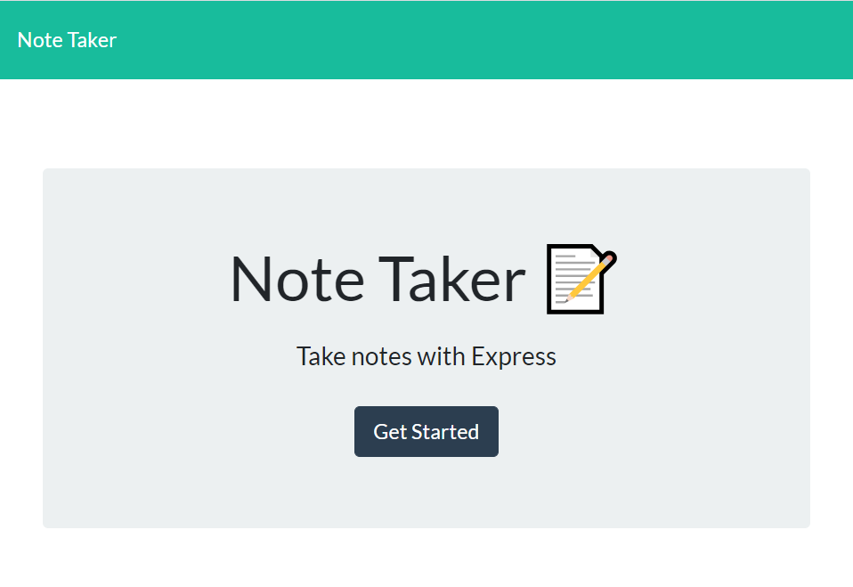
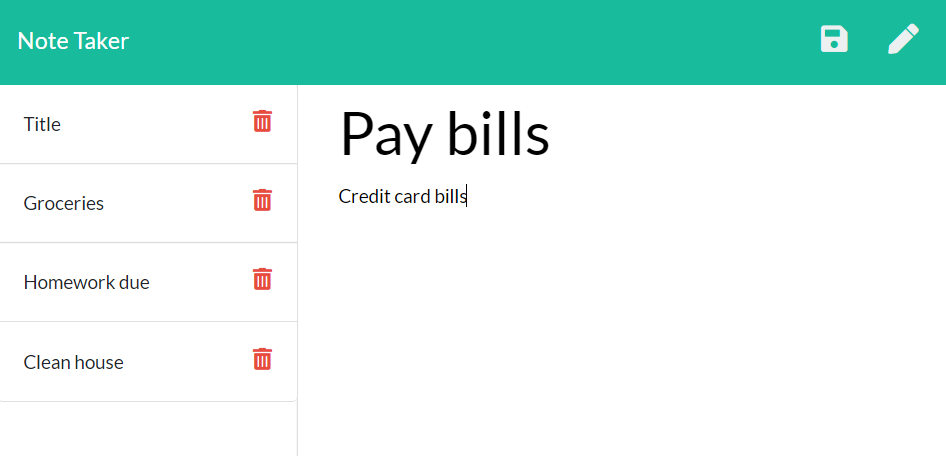

# Note Taker

## Description
The Note Taker application allows users to write, view and delete notes. Given the front-end components of the application, my task was to build the backend server using Express. The second task was to deploy the application on Heroku.

* Link to the app on Heroku: https://secret-scrubland-30787.herokuapp.com/
* Link to the Github repository: https://github.com/akwanmtl/Note-Taker

## Table of Contents

* [Usage](#usage)
* [Credits](#credits)
* [License](#license)

## Usage 

When you open the application, you are presented with the landing screen:

When you press on 'Get Started' you are presented with the main part of the application. On the left, you will have the list of the titles of notes that have been saved previously. On the left you are presented with the section where you can write a new note or view an already saved note. 

To create a new note, click on the pencil icon if there is a note tht is already displayed in the right hand part. Then, enter the note's title and content. The save button will appear and click on it to save. The note's title will appear on the list on the left. Each note is provided with a unique ID allowing the application to track which note selected to be viewed or deleted. The Crypto package was used to generate the ID.

To view an already saved note, click on the note's title that you would like to see. The note's title and content will be displayed on the right. You will not be able to make any change to the note.

To delete a note, click on the garbage can icon. The note will be removed from the list.

Here is a screenshot main portion of the Note Taker applicatoin:

## Credits

* [Creating unique ID tutorial](https://www.geeksforgeeks.org/how-to-add-unique-id-to-each-record-in-your-local-custom-database-in-node-js/)
* [License badge link](https://gist.github.com/lukas-h/2a5d00690736b4c3a7ba)

## License

Copyright (c) [2020] [Annie Kwan]
